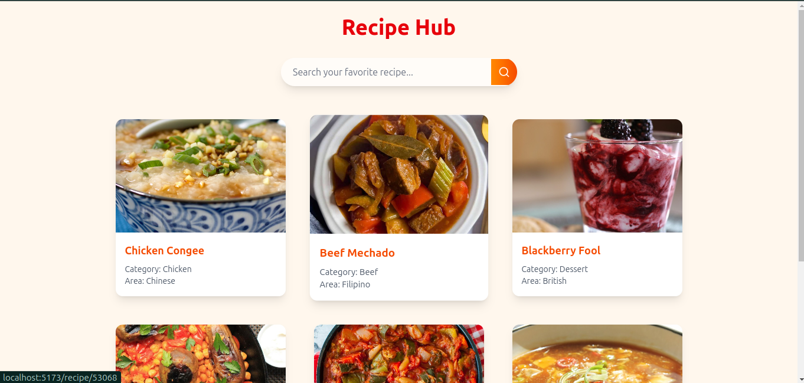
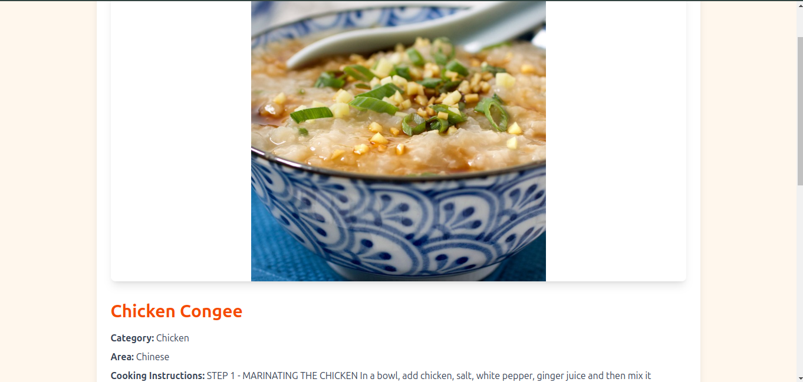
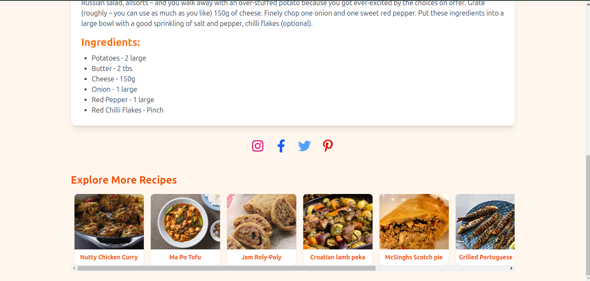

# 🍳 Recipe Hub

Recipe Hub is a modern and interactive recipe discovery application built with **React**, **Tailwind CSS**, and **TheMealDB API**. It allows users to browse a wide range of recipes, view detailed cooking instructions, and share their favorite meals on social media. 

---
Demo video 👉  https://lnkd.in/g3jVxK9g
---
## 📸 Screenshots






---

## 🚀 Features

- 🍽️ Browse and explore recipes fetched from TheMealDB API.
- 📄 View complete recipe details including:
  - Meal name, category, area.
  - Ingredients and measurements.
  - Step-by-step cooking instructions.
  - High-quality meal image.
- 🎥 Splash screen animation on app load.
- 📱 Responsive and modern UI with **Tailwind CSS**.
- 📤 Share recipes on Instagram, Facebook, Twitter, and Pinterest.
- 📚 Horizontal carousel on the recipe details page to discover more recipes.
- ⚡ Smooth transitions and animations.

---

## 🛠️ Tech Stack

- **React**
- **React Router DOM**
- **Tailwind CSS**
- **TheMealDB API**
- **React Icons**

---

## 📦 Installation & Setup

1. **Clone the repository**

   ```bash
   git clone https://github.com/your-username/recipe-hub.git
   cd recipe-hub
   
2.**Install dependencies** 

```bash
npm install
```
3. **Start the development server**

```bash
npm run dev
```
4. **Open your browser at http://localhost:5173 to view the app.**

## 🌐 API Reference
### TheMealDB API

